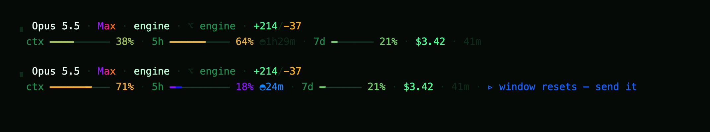

# phosphor

A status line for Claude Code that's alive.



**Line one:** the model, the effort, the folder, the branch, the PR, and your diff.
**Line two:** how much room you have left: context, the 5-hour window with a countdown, and the 7-day window. Then spend and time.

- The bars shimmer. A bar that moves reads as live; a static one reads as a screenshot.
- Colour is a continuous ramp, from muted neon green through amber to red. No three-bucket traffic light.
- **The max rule:** wherever the word "max" appears, it runs a hot neon band. Max is the ceiling, and the ceiling is the only thing allowed to be every colour at once.
- **Use it or lose it:** if the 5-hour window is under half used and resets within the hour, the bar goes full spectrum and says *send it*.
- Folder, branch and PR are OSC 8 links. Cmd-click opens them.

Everything comes from the JSON Claude Code pipes in. No log scraping, no API calls, no dependencies.

## Install

```sh
git clone https://github.com/1stPercentile/phosphor ~/.phosphor
```

Then add this to `~/.claude/settings.json`:

```json
"statusLine": {
  "type": "command",
  "command": "python3 ~/.phosphor/statusline.py",
  "padding": 0,
  "refreshInterval": 1
}
```

You need Python 3 and a truecolor terminal.

The animation runs off the wall clock, not a frame counter. Claude Code re-runs the script about once a second, so the motion stays continuous even though every frame is a new process.
