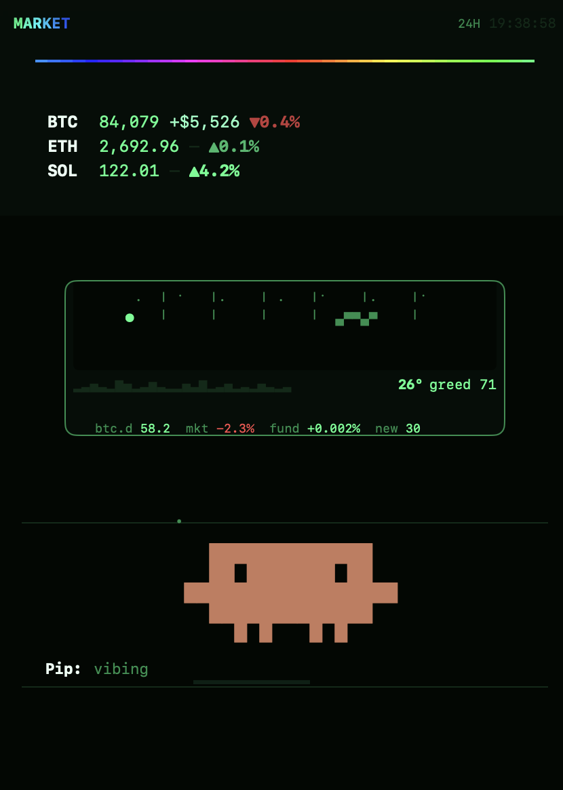

# phosphor

A green CRT for the whole stack: terminal, shell, cmux sidebar, Claude Code and Obsidian. One install.



**The sidebar** has three parts:

- **The board.** Live prices, month-to-date in dollars, and the 24h move. Colour carries the size of the move, not just its sign.
- **The sky.** The real sun, moon and stars over wherever you are. The weather comes from the market: clouds thicken with fear, rain falls when the market bleeds, and a crash is a storm. A tape underneath shows BTC dominance, market cap, funding and new listings.
- **Pip.** The Claude Code mascot, alive. He blinks, looks around, dances, copes and touches grass, with a new random minute of behaviour every minute. When Claude starts working, he gets to work. When Claude needs you, he waves.

**The terminal** is one hue at many brightnesses. A CRT shader adds glass curvature, an aperture grille, scanlines and bloom. The beam blooms as you type, and the tube warms up when a pane takes focus.

**The shell** has a prompt that reads as state rather than decoration. Output is colour-coded by type, and input turns amber before you run a command that doesn't exist.

**Claude Code** gets a status line with shimmering usage bars. When your 5-hour window is about to reset with room left, it tells you to send it.

**Obsidian** gets the same law. Resolved links are live green, broken links are amber, and the graph view becomes a HUD.

<br clear="right">


## Install

```sh
git clone https://github.com/1stPercentile/phosphor ~/.phosphor
~/.phosphor/install.sh                       # add --vault ~/Notes to theme an Obsidian vault
```

This needs macOS, Python 3 and [cmux](https://cmux.com), with Claude Code for the status line.

The installer only adds to your config. It backs up every file it touches (`*.phosphor-bak-*`), prints anything it can't merge safely, and reads each step back rather than assuming it worked. Before you commit to it, you can preview or undo it:

```sh
~/.phosphor/install.sh --dry-run
~/.phosphor/install.sh --uninstall
```

## The colour law

| | | |
|---|---|---|
| `#41FF8D` | live | a real value, a resolved link, something working |
| `#1F8F4E` | chrome | labels, structure, anything you skip |
| `#0C2A17` | rule | dividers, tracks, the empty part of a bar |
| `#EAFFF3` | hot | the one thing to look at, and what you typed |
| `#FFB000` | amber | **the machine is wrong**: an error, a broken link |
| `#FF4D4D` | red | down, in markets only |

Amber is the machine. Red is the market.

## Configure

| file | |
|---|---|
| `~/.config/phosphor/tokens.txt` | What the board watches: majors by CoinGecko id, anything onchain by token address |
| `~/.config/phosphor/location.txt` | `lat,lon` for the sky, if you'd rather not use IP location |
| `~/.config/phosphor/units` | `f` for Fahrenheit |

Pip picks a mood at random each minute. To pin one:

```sh
echo "dancing" > ~/.cache/phosphor/pip/state.txt     # empty the file to let him roam
```

The moods are `vibing`, `dancing`, `locked in`, `doomscrolling`, `coping`, `gm`, `touching grass`, `up only`, `thinking`, `plotting`, `trading`, `mining` and `phone`.

## How the sidebar works

The cmux sidebar runtime has no network and no filesystem, so nothing in it can fetch. A launchd job (`com.phosphor.tick`) runs once a minute. It fetches prices and weather from keyless APIs, then **bakes them into the sidebar as literal SwiftUI**, and cmux hot-reloads the file.

The interpreter redraws about once a second and fails silently. A colour held in a `let` renders the default, and `\n` prints literally. So every animation is a 60-frame schedule keyed off `clock.second`, emitted as functions that return literals. `tests/test_sidebar.py` enforces those rules on every mood.

```
claude-code/   status line
cmux/          sidebar template, theme snippet, notification sound
engine/        the minute tick: prices, sky, Pip, the bake
ghostty/       palette, font, CRT shader
obsidian/      theme, workbench snippet, graph HUD
zsh/           prompt, colours, completion, highlighting
```

MIT.
